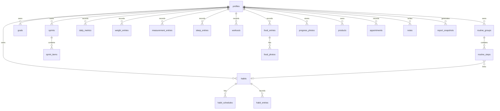

# Database

## Status

This document describes the intended Supabase/Postgres architecture and current migration state. It should evolve alongside implementation and migrations.

**ACTIVE DEVELOPMENT TARGET:** V0.5 daily personal tracker.

The V0.5 database foundation has been created and applied. Functional V0.5 uses the dedicated V0.5 tables and Storage bucket below.

Current migration state:

- Local migration foundation exists at `supabase/migrations/0001_app_foundation.sql`.
- Remote migration history records `0001_app_foundation.sql` and `0002_profiles_api_grants.sql` as applied.
- `0001_app_foundation.sql` creates only the `profiles` foundation table, timestamp trigger, and owner-only RLS policies.
- `0002_profiles_api_grants.sql` grants API table privileges for authenticated profile access while leaving row-level access to the owner-only RLS policies.
- Remote migration history records `0003_habits_and_routines.sql` as applied.
- Milestone 1 adds universal habit and routine tables in `supabase/migrations/0003_habits_and_routines.sql`.
- Remote migration history records `0004_v05_daily_tracker.sql` as applied.
- `0004_v05_daily_tracker.sql` adds `v05_daily_entries`, `v05_checklist_completions`, `v05_food_photos`, and the private `v05-food-photos` Storage bucket/policies.
- Goals/sprints remain deferred because the Goals model is provisional until Milestone 3 refinement.
- The V1 habit/routine tables are dormant for active V0.5 work. Do not drop, reset, rewrite, or migrate away from them.

## Design Principles

- Use relational structure for data that needs reliable analytics.
- Use the universal habit system for configurable recurring behaviors.
- Avoid turning every tracked metric into an unstructured blob.
- Keep all personal data private by default.
- Use soft deletion/archive strategies for user-created data where accidental loss matters.
- Persist weekly and monthly report snapshots.
- Every tracked metric has exactly one canonical source of truth. Views should read from canonical records instead of creating duplicate editable values.
- For V0.5, prefer a deliberately small dedicated model over forcing the simplified tracker through the V1 universal habit/routine schema.

## Approved V0.5 Tables

These table names are approved and implemented in `supabase/migrations/0004_v05_daily_tracker.sql`.

### `v05_daily_entries`

One row per profile and local calendar date.

- `id` uuid primary key
- `user_id` references `profiles.id`
- `entry_date` date
- `weight` numeric nullable
- `steps` integer nullable
- `sleep_duration_minutes` integer nullable
- `bedtime` time nullable
- `wake_time` time nullable
- `previous_day_calories` integer nullable
- `worked_out` boolean not null default false
- `workout_activity_type` text nullable
- `workout_duration_minutes` integer nullable
- `notes` text nullable
- `created_at` timestamptz
- `updated_at` timestamptz
- unique `(user_id, entry_date)`

Purpose:
Own the editable V0.5 daily scalar fields. Today and History update the same row for a date rather than creating duplicate daily records. Progress derives weight data from this table.

This table also supplies data-based streak inputs, such as sleep duration and steps. Streak counts should be derived from rows in this table rather than stored as independent counters.

### `v05_checklist_completions`

One row per profile, date, and fixed checklist item key.

- `id` uuid primary key
- `user_id` references `profiles.id`
- `entry_date` date
- `item_key` text
- `completed` boolean not null default false
- `created_at` timestamptz
- `updated_at` timestamptz
- unique `(user_id, entry_date, item_key)`

Purpose:
Store completion state for the fixed V0.5 checklist. Checklist item definitions remain in code or static configuration for V0.5. Do not introduce a user-facing habit/schedule builder.

Due-ness is not stored here. The application determines whether an item was due on a date from fixed checklist definitions and then joins against this table to determine completion.

Approved fixed checklist definitions:

| Key | Label | Cadence | Anchor date |
| --- | --- | --- | --- |
| `morning_skincare` | Morning Skincare | daily | |
| `evening_skincare` | Evening Skincare | daily | |
| `vitamins` | Vitamins | daily | |
| `minoxidil` | Minoxidil | daily | |
| `workout` | Worked Out | daily | |
| `iron` | Iron | every_other_day | `2026-08-12` |
| `irestore_helmet` | iRestore Helmet | every_other_day | `2026-08-12` |
| `irestore_mask` | iRestore Mask | every_other_day | `2026-08-12` |

Item keys are stable historical identifiers. Display labels may change without changing keys.

### `v05_food_photos`

One row per uploaded food photo.

- `id` uuid primary key
- `user_id` references `profiles.id`
- `entry_date` date
- `storage_path` text
- `meal_type` text nullable
- `note` text nullable
- `created_at` timestamptz
- `updated_at` timestamptz
- `deleted_at` timestamptz nullable

Purpose:
Support Today food photo uploads and the History scrapbook gallery. Food photos should be stored in the approved private Supabase Storage bucket `v05-food-photos`.

### V0.5 RLS And Storage Direction

V0.5 tables use owner-only RLS following the existing `profiles` ownership pattern. Authenticated users may read, insert, and update only their own rows. Food photo metadata is soft-deleted in the database. Storage object deletion is owner-scoped for the private V0.5 bucket.

Storage paths should include an owner/profile prefix to make private bucket policies straightforward.

### V0.5 Recurrence Storage Boundary

V0.5 does not need a recurrence table. Fixed checklist item definitions can live in code/static configuration with:

- `key`
- `label`
- `cadence`: `daily` or `every_other_day`
- `anchor_date` for every-other-day items
- optional display metadata

Every-other-day due dates are derived by counting whole calendar days between `entry_date` and `anchor_date`; an item is due when that difference is divisible by 2. Dates before the anchor are not due unless explicitly configured otherwise.

Approved every-other-day anchor:

- `iron`, `irestore_helmet`, and `irestore_mask` all use `2026-08-12`.
- They are due August 12, August 14, August 16, August 18, and so on.
- They are not due August 13, August 15, August 17, and so on.

### V0.5 Monthly Calendar And Streak Derivation

V0.5 does not need tables for monthly completion percentages, streak counters, achievements, badges, or goals.

Monthly completion calendar state is derived from:

- Fixed checklist definitions.
- `v05_checklist_completions`.
- The tracking start boundary.
- The current date.

Tracking begins on the date of the user's first saved V0.5 daily entry. Dates before that first saved entry are neutral and must not count as failed, 0% completion, streak breaks, or reduced completion statistics.

For each date:

- Future dates are disabled/neutral and do not count as failure.
- Dates before tracking began are inactive/neutral.
- Dates on or after tracking began use only checklist items due on that date as the denominator.
- Completion percentage is completed due items divided by due items.
- 80-100% is Great, 50-79% is Good, 1-49% is Some progress, and 0% is No activity.

If no checklist items were due, the date should be neutral rather than failed.

A saved daily entry with zero completed due checklist items can legitimately represent a 0% / No activity checklist day.

Streaks are derived from canonical records:

- Checklist streaks use fixed checklist definitions plus `v05_checklist_completions`.
- Daily checklist item streaks count consecutive successful calendar days.
- Every-other-day checklist item streaks count consecutive successful due dates, not consecutive calendar days.
- Data-based streaks use `v05_daily_entries` and fixed/configured thresholds, such as 7+ hours of sleep or a step target.

Approved initial displayed streaks:

- Workout.
- 7+ hours of sleep.
- 7,500+ steps.
- Vitamins.

Approved initial thresholds:

- Sleep goal: `sleep_duration_minutes >= 420`.
- Step goal: `steps >= 7500`.

Do not store a separate value such as `workout_streak = 6` in the initial V0.5 schema. Historical edits should naturally update derived calendar and streak results.

## Dormant V1 Tables

The following tables already exist remotely and remain preserved for deferred V1 work:

- `habits`
- `habit_schedules`
- `habit_entries`
- `routine_groups`
- `routine_steps`
- `routine_step_entries`

Do not destructively alter these tables as part of V0.5.

## Proposed Tables

The tables below describe the larger deferred V1 architecture. They are not the active V0.5 schema unless explicitly re-approved.

### Identity

`profiles`

- `id` primary key
- `auth_user_id` references Supabase auth user
- `display_name`
- `timezone`
- `unit_system`
- `created_at`
- `updated_at`

### Universal Habits

`habits`

- `id` primary key
- `user_id` references `profiles.id`
- `name`
- `description`
- `category`
- `icon`
- `tracking_type`
- `target_value`
- `target_unit`
- `time_group`
- `start_date`
- `end_date`
- `active`
- `include_in_glow_score`
- `display_order`
- `archived_at`
- `created_at`
- `updated_at`

Milestone 1 uses constrained text for `tracking_type` and `time_group`. Habits are archived/deactivated rather than hard-deleted during normal app use so historical entries remain meaningful.

`habit_schedules`

- `id` primary key
- `user_id` references `profiles.id`
- `habit_id` references `habits.id`
- `schedule_type`
- `weekdays`
- `times_per_week`
- `times_per_month`
- `interval_days`
- `anchor_date`
- `start_date`
- `end_date`
- `created_at`
- `updated_at`

For `every_x_days`, `anchor_date` is required and recurrence is calculated relative to that date. For example, an every-2-days habit anchored on August 10 is due on August 10, August 12, August 14, and so on. The schedule engine must not base recurrence on the current day.

For `times_per_month`, the schedule sets a monthly completion target without requiring exact calendar dates. V1 should not become a full recurrence engine.

Milestone 1 enforces straightforward structural schedule constraints in the database. Higher-level recurrence conflict validation remains in application/domain logic and tests.

`habit_entries`

- `id` primary key
- `habit_id` references `habits.id`
- `user_id` references `profiles.id`
- `entry_date`
- `completed`
- `value_numeric`
- `value_duration_minutes`
- `value_quantity`
- `notes`
- `source`
- `created_at`
- `updated_at`
- `deleted_at`

V1 stores one aggregate active entry per habit per calendar date. Duration, numeric, and quantity values represent the day's aggregate value, not individual same-day sessions.

### Routines

`routine_groups`

- `id` primary key
- `user_id` references `profiles.id`
- `name`
- `category`
- `time_group`
- `display_order`
- `active`
- `archived_at`
- `created_at`
- `updated_at`

`routine_steps`

- `id` primary key
- `user_id` references `profiles.id`
- `routine_group_id` references `routine_groups.id`
- `linked_habit_id` nullable reference to `habits.id`
- `name`
- `display_order`
- `active`
- `archived_at`
- `created_at`
- `updated_at`

Linked routine steps write completion/value state through the linked habit's `habit_entries`.

`routine_step_entries`

- `id` primary key
- `user_id` references `profiles.id`
- `routine_step_id` references `routine_steps.id`
- `entry_date`
- `completed`
- `notes`
- `source`
- `created_at`
- `updated_at`
- `deleted_at`

Unlinked routine steps write completion through `routine_step_entries`. Do not create duplicate completion records in both systems for the same step.

### Goals and Sprints

`goals`

- `id` primary key
- `user_id` references `profiles.id`
- `name`
- `type`
- `start_date`
- `target_date`
- `metric_type`
- `target_value`
- `status`
- `notes`
- `created_at`
- `updated_at`
- `archived_at`

The Goals schema is provisional. `metric_type` and `target_value` may not be expressive enough for all V1 goals, including weight targets, daily duration goals, weekly frequency goals, sleep minimums, and metric targets. The final Goals schema and progress-calculation model must be deliberately reviewed before Goals are implemented in Milestone 3. Milestone 0 must not prematurely lock the project into a goal model that prevents habit-based, frequency-based, duration-based, or metric-target goals.

`sprints`

- `id` primary key
- `user_id` references `profiles.id`
- `name`
- `start_date`
- `end_date`
- `status`
- `notes`
- `created_at`
- `updated_at`
- `archived_at`

`sprint_items`

- `id` primary key
- `sprint_id` references `sprints.id`
- `linked_habit_id` nullable reference to `habits.id`
- `linked_goal_id` nullable reference to `goals.id`
- `label`
- `target_value`
- `created_at`
- `updated_at`

### Daily and Domain Records

`daily_metrics`

- `id` primary key
- `user_id` references `profiles.id`
- `date`
- `steps`
- `fasting_glucose`
- `resting_heart_rate`
- `period_status`
- `manual_calorie_total`
- `notes`
- `created_at`
- `updated_at`

`manual_calorie_total` is an optional user-entered daily total for days when food entries are incomplete. It is distinct from the derived food-log calorie sum calculated from `food_entries.calories`.

`weight_entries`

- `id` primary key
- `user_id` references `profiles.id`
- `date`
- `weight`
- `source`
- `notes`
- `created_at`
- `updated_at`
- `deleted_at`

`measurement_entries`

- `id` primary key
- `user_id` references `profiles.id`
- `date`
- `measurement_type`
- `value`
- `unit`
- `notes`
- `created_at`
- `updated_at`
- `deleted_at`

`sleep_entries`

- `id` primary key
- `user_id` references `profiles.id`
- `sleep_date`
- `bedtime`
- `wake_time`
- `duration_minutes`
- `quality`
- `notes`
- `created_at`
- `updated_at`
- `deleted_at`

`sleep_date` is the calendar date on which the user wakes up. A sleep from August 10 at 11:30 PM to August 11 at 7:30 AM has `sleep_date` August 11.

`workouts`

- `id` primary key
- `user_id` references `profiles.id`
- `date`
- `workout_type`
- `duration_minutes`
- `estimated_calories`
- `notes`
- `created_at`
- `updated_at`
- `deleted_at`

`food_entries`

- `id` primary key
- `user_id` references `profiles.id`
- `eaten_at`
- `source`
- `description`
- `portion_notes`
- `eating_reason`
- `hunger_before`
- `fullness_after`
- `still_hungry`
- `satisfaction`
- `craving_details`
- `calories`
- `protein`
- `carbs`
- `fat`
- `nutrition_estimate`
- `notes`
- `created_at`
- `updated_at`
- `deleted_at`

`source` preserves lightweight entry provenance without creating
AI-specific architecture. Intended values are `manual`, `external_ai`,
and potentially `in_app_ai` if a future approved milestone adds in-app
AI analysis. `nutrition_estimate` indicates that calorie and macro
values are estimates rather than measured or label-derived values. These
fields do not create duplicate sources of truth: calories and macros
remain stored on `food_entries`, and food photos remain attached through
`food_photos`.

`food_photos`

- `id` primary key
- `food_entry_id` references `food_entries.id`
- `user_id` references `profiles.id`
- `storage_path`
- `label`
- `created_at`
- `deleted_at`
- `permanently_deleted_at`

`progress_photos`

- `id` primary key
- `user_id` references `profiles.id`
- `date`
- `storage_path`
- `label`
- `associated_weight_entry_id` nullable reference to `weight_entries.id`
- `notes`
- `created_at`
- `deleted_at`
- `permanently_deleted_at`

`products`

- `id` primary key
- `user_id` references `profiles.id`
- `name`
- `category`
- `start_date`
- `end_date`
- `active`
- `image_path`
- `notes`
- `created_at`
- `updated_at`
- `archived_at`

`appointments`

- `id` primary key
- `user_id` references `profiles.id`
- `appointment_type`
- `scheduled_at`
- `provider`
- `location`
- `notes`
- `completed`
- `created_at`
- `updated_at`
- `deleted_at`

`notes`

- `id` primary key
- `user_id` references `profiles.id`
- `date`
- `body`
- `tags`
- `created_at`
- `updated_at`
- `deleted_at`

### Reports

`report_snapshots`

- `id` primary key
- `user_id` references `profiles.id`
- `report_type`
- `period_start`
- `period_end`
- `generated_at`
- `generator_version`
- `summary_json`
- `created_at`

Weekly and monthly reports should persist as snapshots. Regeneration should be an intentional action that creates or replaces a snapshot according to an explicit UI flow.

## Proposed Enums

- `tracking_type`: checkbox, numeric, duration, quantity
- `schedule_type`: daily, weekdays, times_per_week, times_per_month, every_x_days, optional
- `time_group`: morning, afternoon, evening, anytime
- `goal_type`: target, habit_adherence, sprint, maintenance
- `goal_status`: active, paused, complete, archived
- `sprint_status`: planned, active, complete, archived
- `eating_reason`: hungry, craving, bored, emotional, social, habit, it_was_there, other
- `food_entry_source`: manual, external_ai, in_app_ai
- `photo_label`: front, side, back, custom
- `report_type`: weekly, monthly

Final enum implementation may use Postgres enums or constrained text depending on migration ergonomics. Pick deliberately during Milestone 0.

## Canonical Sources of Truth

| Data | Canonical source | Notes |
| --- | --- | --- |
| Weight | `weight_entries` | One weight record per intended date/source; Today and Body read the same data. |
| Measurements | `measurement_entries` | Measurement type distinguishes standard and custom measurements. |
| Steps | `daily_metrics.steps` | Habits/goals may reference steps for adherence, but should not store a second steps value in `habit_entries`. |
| Fasting glucose | `daily_metrics.fasting_glucose` | Daily scalar metric. |
| Resting heart rate | `daily_metrics.resting_heart_rate` | Daily scalar metric. |
| Period status | `daily_metrics.period_status` | Daily status field. |
| Sleep | `sleep_entries` | Assigned to wake date via `sleep_date`. |
| Workouts/exercise | `workouts` | Workout records own type, duration, calories, and notes. |
| Derived food-log calories/macros | `food_entries` | Sum per-entry values when present. |
| Manual daily calories | `daily_metrics.manual_calorie_total` | Separate fallback total for incomplete food logs. |
| Farsi/piano/growth practice | `habit_entries` | Duration/quantity entries for configurable growth habits. |
| Routine/habit completion | `habit_entries` | Routine groups organize linked habit completions. |

Derived values, such as food-log calorie sums, weekly adherence, streaks, and report observations, should normally be calculated from canonical records. Persist only where a decision says to preserve historical generated output, such as report snapshots.

## Relationships

## RLS Strategy

All application tables should include `user_id` unless they are purely global reference tables. V1 should avoid global editable reference tables unless needed.

Policies should allow authenticated users to select, insert, update, and delete only rows owned by their profile/user id.

Storage policies should protect files by owner. Storage paths should include a user-specific prefix to make ownership checks straightforward.

## Storage Buckets

Planned private buckets:

- `food-photos`
- `progress-photos`
- `product-images` if product images are implemented

Use signed URLs or authenticated access patterns. Do not make personal photo buckets public.

## Soft Deletion Strategy

- Configurable entities use `archived_at` when they should disappear from normal active views but remain historically meaningful.
- User-entered records use `deleted_at` when accidental deletion protection matters.
- Photo records include `deleted_at` and `permanently_deleted_at`.
- Permanent storage deletion must be explicit and approval-worthy outside normal app behavior.

## Migration Rules

- Keep migrations reproducible.
- Prefer small, reviewable migrations.
- Prepare non-destructive migrations locally within approved scope.
- Do not apply remote migrations without approval at Level 1.
- Destructive migrations are a permanent STOP condition.
- Authentication, RLS, and storage security changes require careful review and may require approval.
